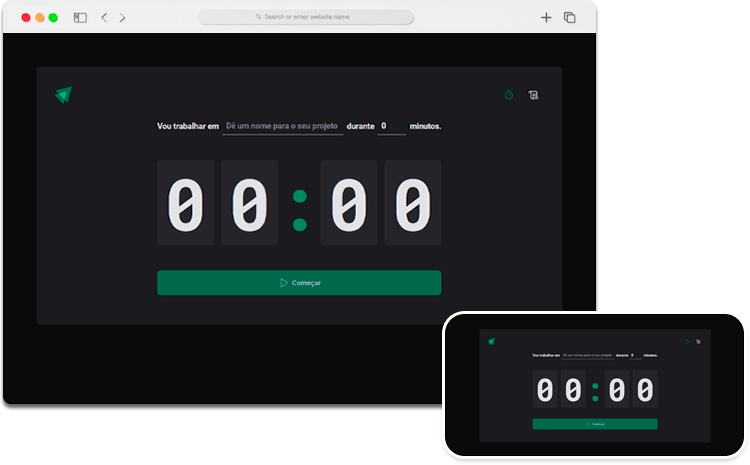

<h1 align="center">Ignite Timer</h1>

  

### Ignite Timer (ReactJS + TypeScript)

Mais um projeto concluído junto a @RoketSeat na trilha Inginite.

O projeto se trata de um timer com histórico, para por em prática os conceitos do ReactJS.

## Stack utilizada

**Front-end:** ViteJS, ReactJS, TypesScript, CSS, HTML

**Back-end:** Node

## Aprendizados

Neste projeto coloquei em pratica os fundamentos do ReactJS:
 - Componentes
 - Estado
 - Propriedades
 - Fluxo de Renderização
 - React Hooks

Extras:
 - localstorage
 - date-fns

<small>Wesley Policena - 2023</small>
